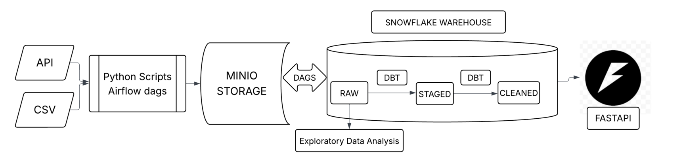
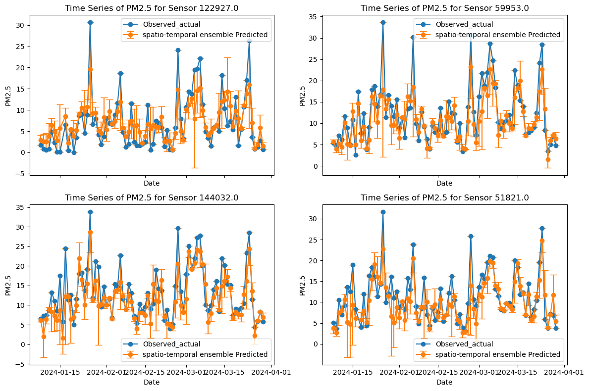
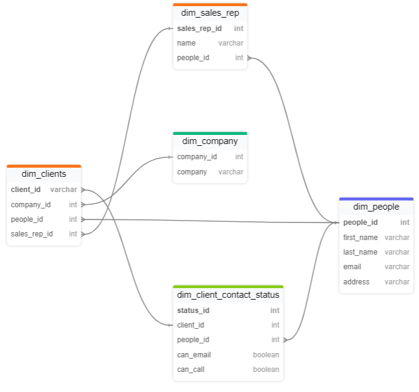

# Portfolio

---

## Projects
### Data Engineering Project 3: Marvan Think Tank Covid-19 Multinational Data Catalog

[](https://github.com/siwa-p/marvan_research_data_pipeline)
[](https://github.com/siwa-p/marvan_project_eda)
[](https://github.com/siwa-p/marvan_research_covid_api)

*Key Skills: Data Engineering, ELT Pipelines, Python, SQL, API Development, Cloud Storage, Unit Testing, Static Code Analysis*

**Team:**  
- [Michael Galo](https://github.com/MichaelGalo)  
- [Alex Berka](https://github.com/alexberka)

This comprehensive group project for the NSS Data Engineering Bootcamp involved building a production-ready multinational Covid-19 open data catalog for Marvan, a strategic think tank. The primary objective was to aggregate and standardize national-level datasets from the United States, United Kingdom, and Canada, focusing on Covid-19, SARS-CoV-2, and Coronavirus data.

Key Technical Achievements:

- Data Discovery & Schema Design: Surveyed government open data portals and designed a standardized metadata schema for cross-national dataset cataloging.
- Orchestrated ELT Pipeline: Built a robust ELT pipeline with Apache Airflow orchestration to automate data ingestion, cleaning, and storage in cloud environments.
- Enterprise Data Architecture: Implemented a Snowflake data warehouse using the Medallion architecture (bronze, silver, gold layers) with dbt transformations for data modeling and quality assurance.
- Automated Quality Testing: Deployed comprehensive data quality testing and automated checks using dbt and GitHub Actions CI/CD.
- Production API Development: Developed a FastAPI-based Python API with Swagger documentation, enabling users to filter and retrieve datasets by country, keyword, and update date.
- Code Quality & Testing: Implemented unit testing and static code analysis (Black) with full documentation and results tracking.

This project demonstrates enterprise-level data engineering skills including cloud-based pipeline orchestration, collaborative development practices, and building production-ready, scalable data infrastructure for real-world analytics applications.

</div>
<br>
<center></center>
<br>

### <ins>Air Quality</ins>: *"Machine learning models applied to air quality data"* <br>

[](https://github.com/siwa-p/Air-quality-monitoring-and-prediction-using-PurpleAir-data)

*Key Skills: APIs, Python (PyTorch, scikit-learn, Pandas), Regression, Machine Learning*

This project explores predictive modeling for air-quality monitoring using low-cost PurpleAir sensors (PM2.5) in the Dallas area (2022–2024) and meteorological data from [NOAA](https://www.noaa.gov/). The motivation is to leverage the dense network of affordable sensors, which, despite lower accuracy, provide valuable, accessible data for research and public awareness—especially when corrected using recent EPA schemes.

The main questions addressed are: Can machine learning models predict air quality using sensor and weather data? Can neural networks further improve predictions?

Data was collected via the [PurpleAir API](https://api.purpleair.com/) and processed alongside NOAA weather data. Exploratory analysis showed noisy, highly variable time series. Statistical tests (ADF) confirmed stationarity, supporting ARIMA modeling. However, ARIMA ignores spatial dependencies, so tree-based regressions (XGBoost) were used for both temporal and spatial features, with an ensemble approach yielding improved accuracy.

To capture both spatial and temporal patterns, a 3D convolutional neural network was implemented, using kriging interpolation to generate input images from sparse sensor locations. The neural network demonstrated promising results in predicting future air quality patterns.
<br>
<center></center>
<br>

---
### <ins>NPPES Healthcare Analytics</ins>: *"ETL pipeline for healthcare provider distribution analysis across US counties"* <br>

[](https://github.com/siwa-p/NPPES-Project)

Key Skills: ETL Pipelines, Python (Polars, Pandas), PostgreSQL, Azure Functions, API Integration, Data Engineering

This project builds a comprehensive data engineering solution to analyze healthcare provider distribution across US counties using the National Plan and Provider Enumeration System (NPPES) dataset.

The main questions addressed are: How are healthcare providers distributed geographically across US counties? Can we efficiently process and analyze 8M+ provider records to enable real-time healthcare analytics?

Data processing involved handling a 10GB+ NPPES dataset through a multi-stage ETL pipeline. The solution leverages Polars for high-performance data processing with lazy loading from Parquet files, PostgreSQL for robust data storage with optimized stored procedures, and Azure Functions for cloud automation. Multiple data sources were integrated including ZIP-county crosswalks, FIPS codes, NUCC taxonomy classifications, and US Census population data via API calls.

The pipeline successfully processed 8M+ healthcare provider records, creating automated county-level aggregations across US counties. A dedicated stakeholder view was implemented to simplify access to provider data enriched with county demographics, enabling easy access without complex joins.
<br>
<center></center>
<br>
---

### Wildland Fires and their effects on US National Parks visitation

[](https://github.com/siwa-p/Wildland-fires-and-their-effects-on-visitation-data-in-US-National-Parks/tree/main)

*Key Skills: R (Shiny, tidyverse), time-series forecasting, geospatial data visualization*

**Motivation**

Forest fires are a natural process that can benefit ecosystems, but climate change has made wildfires larger and harder to control, causing greater damage to forests and human settlements.

**About the app**

This Shiny app visualizes wildfire incidents in US national parks. Users can select a park and date range to highlight events on the map and view related data. Two time series plots show visitor data and fire events: the left plot displays overall visitation with fire events marked, while the right plot focuses on a selected event and applies a seasonal ARIMA forecast to visitor data after the incident, including a p-value for the fit.

To run the app, use the following R command:

```r
shiny::runGitHub("National-parks-Midcourse", "siwa-p")
```
---

### Forecasting time-series data: A python implementation

[](https://github.com/siwa-p/Time-Series-Forecasting)
[](pdf/TSForecasting.pdf)

*Key Skills: Python (PyTorch, LSTM), Time-series forecasting (ARIMA, Regression-based forecasting)*

This work is a walkthrough for time-series forecasting in Python. Time series data are unique due to their serial dependence, requiring specialized analysis methods and leveraging domain knowledge for effective modeling. The project demonstrates practical steps for handling time series, including data preprocessing, exploratory analysis, feature engineering, and the application of various forecasting models. Emphasis is placed on comparing traditional statistical approaches with machine learning and deep learning techniques to highlight their strengths and limitations in real-world forecasting scenarios.

The work covers three main forecasting approaches:  
• Time series models (Seasonal ARIMA with exogenous variables)  
• Decision-tree-based regression (XGBoost)  
• Neural network models (LSTM)

Each method is implemented in Python and evaluated using a sample revenue dataset. The project compares model performance and visualizes results with matplotlib and seaborn, demonstrating practical forecasting techniques for time-dependent data.

---

### Question-Answering with vector database

[](https://github.com/siwa-p/Question_Answer_Vector_database/tree/main)

*Key Skills: Webscraping, chromadb, NLP, HuggingFace*

<div style="text-align: justify">
This project is an effort to build a simple question-answering model using scraped texts from Wikipedia. This involved scraping Wikipedia articles for each film and extracting the main content, which I then processed and stored in a vector database (ChromaDB). I paired this unstructured text data with a curated set of questions and answers, enabling contextual queries about each movie’s details.

To enable intelligent information retrieval, I used sentence-transformers for semantic search, allowing the system to find relevant context for each question. Leveraging HuggingFace’s question-answering pipeline, the model generated automated answers, which I compared against ground-truth responses to evaluate accuracy. This project demonstrates my skills in web scraping, natural language processing, vector search, and the practical evaluation of AI-generated outputs.
</div>

---

### Using pagination in Python

[](https://github.com/siwa-p/Using-Pagination-in-Python)

*Key Skills: Python, APIs, Pagination*

This project demonstrates how to access and process paginated data from an API using Python, as part of coursework for the Data Engineering Bootcamp at Nashville Software School.

Key steps include authenticating with the API, using query parameters (`offset` and `limit`) to retrieve data in batches, and saving the results to a `.json` file 10 records at a time. The project also covers reformatting and writing the data to a `.csv` file, ensuring proper formatting for tabular data and handling special characters within values.

### Janells Car Sales

[](https://github.com/siwa-p/Jannells-Car-Sales)
[](pdf/jannels_car_sales.pdf)

*Key Skills: Data Engineering, Database Schema design, PostgreSQL stored procedures, sqlalchemy, Python, APIs, Pagination, Data Validation*

This project showcases a complete data engineering pipeline for Jannell's Car Sales. It involved integrating API and CSV data, designing a normalized PostgreSQL database schema, and generating actionable insights for stakeholders.

Key tasks included API integration with pagination, data ingestion using Python and SQLAlchemy, schema design with referential integrity, and data validation using SQL and Python scripts. A consolidated view was created for business reporting, with results exported to CSV and Excel for stakeholders.
<br>
<center></center>
<br>
